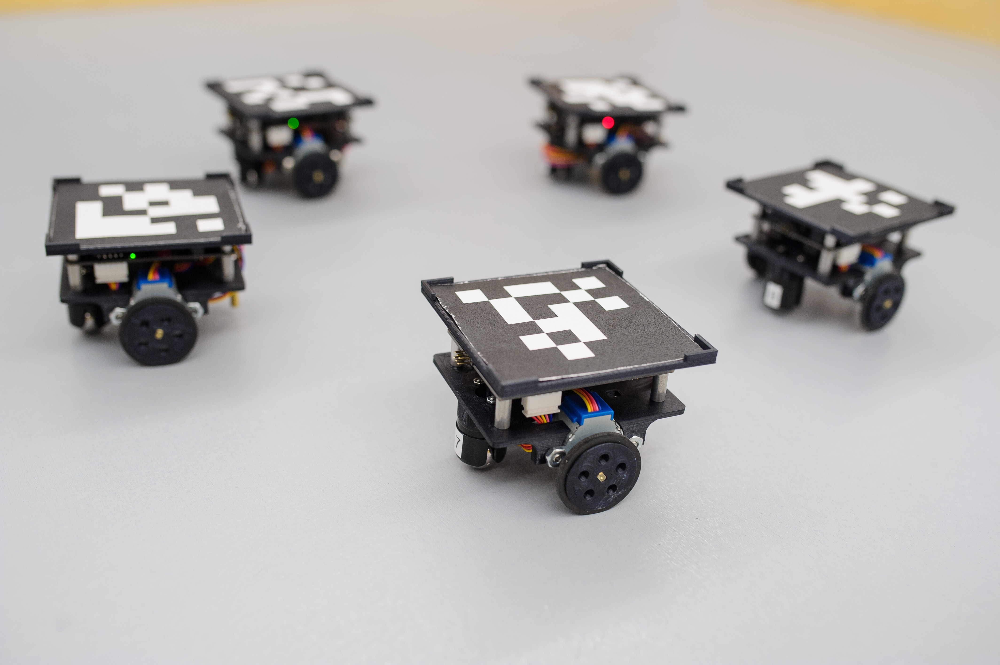
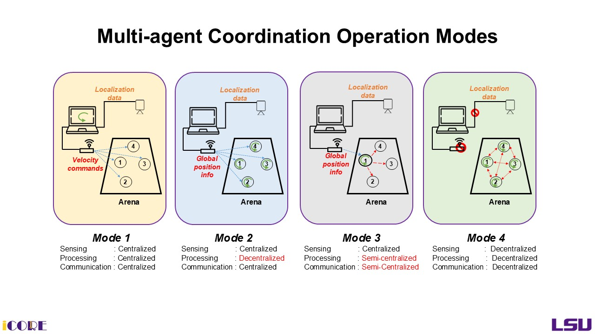
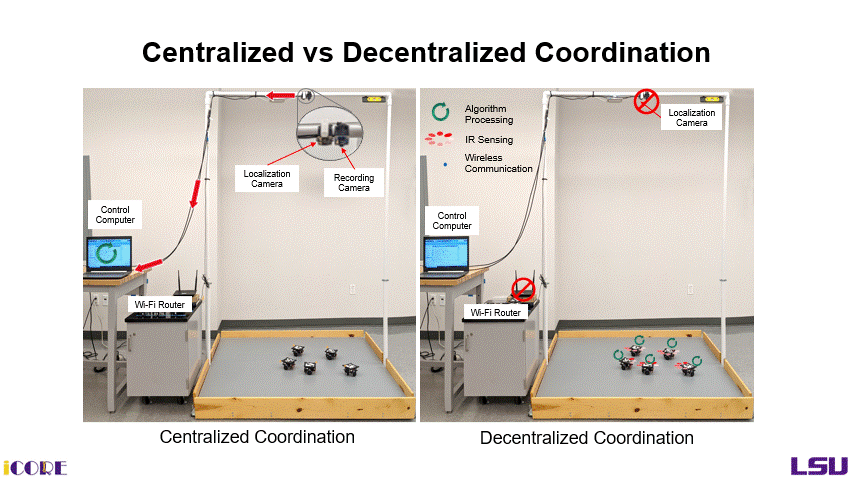
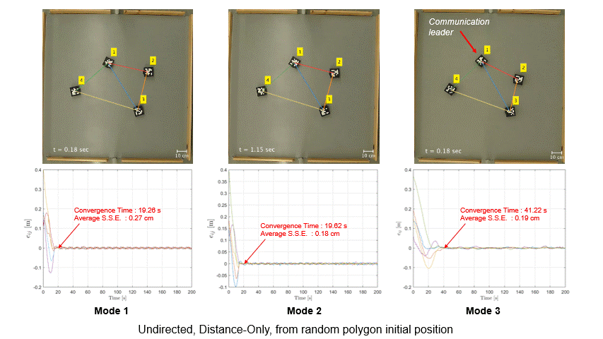
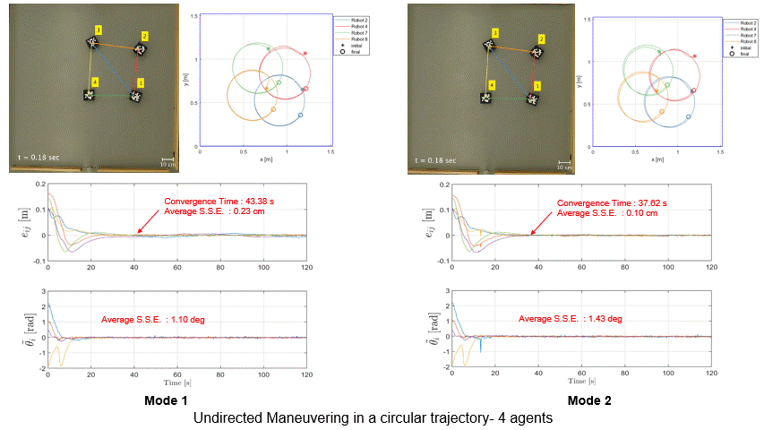
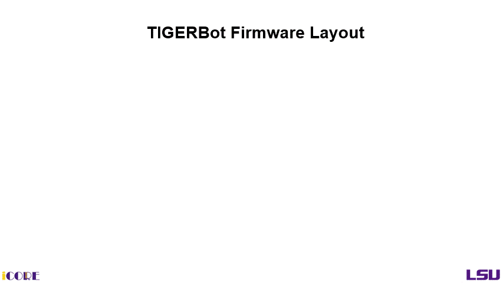

# TIGERSquare — Decentralized Processing for Distance-Based Formation Control

TIGERSquare is a low-cost indoor multi-agent robotic testbed developed at the **LSU iCORE Lab** for experimental validation of formation control algorithms. This repository contains the **ESP8266 firmware and Arduino libraries** that enable decentralized control algorithm processing on the TIGERBots, as described in:

> **T. Sarker**, "Decentralized Processing for Distance-Based Formation Control," M.S. Thesis, Louisiana State University, August 2021.
> [[Read Thesis PDF]](docs/DECENTRALIZED%20PROCESSING%20FOR%20DISTANCE%20BASED%20FORMATION%20CONTROL_Tonmoy%20Sarker_2021.pdf)


---

## Motivation


**Formation control** is one of the fundamental problems in multi-agent coordination — the objective is for agents to form and maintain a prescribed geometric shape in space. This work implements **distance-based formation control**, a well-known approach where inter-agent distances are regulated to values prescribed by the desired shape. This method is inherently decentralized and implementable in each agent's local coordinate frame.


## TIGERSquare Testbed

### Arena
An enclosed 1.5 × 1.5 m platform with a overhead localization camera, a recording camera, and a directional patch antenna.

### Control Station
A laptop running **MATLAB** as control software, connected via Ethernet to a Wi-Fi router. Overhead USB cameras localize robots in real-time using **AprilTag** fiducial markers.

### TIGERBots

A fleet of small wheeled robots called **TIGERBots** (Tiny Intelligently Grouped Experimental Robots). Footprint of 9 × 9 × 9.5 cm with 3D-printed chassis, housing two modular circuit boards:

| Board | Role |
|-------|------|
| **Main Board** (NodeMCU ESP8266 + ATmega 168P) | Locomotion, wireless communication, and onboard control processing |
| **IR Sensor Board** (Teensy 3.2) *(optional)* | Decentralized localization via 8 IR photodiodes and 16 LEDs |



---

## Operating Modes

TIGERSquare supports four operating modes based on the sensing, processing, and communication configuration:

<!-- Add operating modes diagram here -->

| Mode | Sensing | Processing | Communication |
|------|---------|------------|---------------|
| **1 — Centralized** *(baseline)* | Overhead camera | Control PC (MATLAB) | Central (UDP / Wi-Fi) |
| **2 — Decentralized Processing** *(this work)* | Overhead camera | **Onboard ESP8266** | Central (UDP / Wi-Fi) |
| **3 — Semi-Centralized** *(this work)* | Overhead camera | Leader robot | Inter-robot (ESP-NOW) |
| **4 — Fully Decentralized** *(future work)* | IR sensors | Onboard | Inter-robot (ESP-NOW) |







This repository introduces and validates **Modes 2 and 3**. Mode 4 requires integration of the decentralized IR sensing module.

---

## Experiments
To learn the basics of the Distance-based formation control, watch this video:

[](https://www.youtube.com/watch?v=H2j8ldSZRps)


### Formation Acquisition

Agents acquire and maintain a predefined virtual geometric shape from arbitrary initial positions.



**Result:** Decentralized processing (Mode 2) achieved comparable formation quality to centralized (Mode 1), with average steady-state distance errors under 0.4 cm across all configurations.

---

### Formation Maneuvering

Agents simultaneously acquire a formation and maneuver cohesively as a virtual rigid body along a circular trajectory.



**Result:** No systematic deterioration in formation performance between Modes 1 and 2 across all robot counts. 

See thesis Chapter 4 for full quantitative results.

---

## Repository Structure

```
firmware/
├── libraries/
│   ├── TIGERBot_Utility/            # Control utility library (barrier certs, kinematics, parking)
│   ├── TIGERBot_WirelessInterface/  # UDP + ESP-NOW communication
│   ├── TIGERBot_Main/               # Main board coordination
│   ├── TIGERBot_Motor/              # Stepper motor control
│   ├── TIGERBot_IMU/                # IMU interface
│   ├── TIGERBot_I2CInterface/       # I2C bus interface
│   ├── TIGERBot_Messages/           # Message type definitions
│   └── TIGERBot_WiFiConfig/         # Wi-Fi network configuration
└── TIGERBot_firmware/
    └── firmware_main/
        └── firmware_main.ino        # Main robot firmware sketch
```

### TIGERBot Utility Library

The core firmware contribution — a C++ Arduino library porting MATLAB/Robotarium control utilities to the ESP8266 for onboard execution:

| Function | Description |
|----------|-------------|
| `create_si_barrier_certificate` | QP-based collision avoidance (single-integrator) |
| `create_uni_barrier_certificate` | QP-based collision avoidance (unicycle) |
| `create_si_to_uni_mapping_*` | Single-integrator → unicycle velocity transform |
| `create_uni_to_si_mapping_*` | Unicycle state → single-integrator transform |
| `create_automatic_parking_controller2` | Drive robot to target pose within error bounds |
| `getPolygonDims` | Generate polygon vertices for N-robot initial conditions |
| `create_is_initialized` | Check all robots have reached their starting positions |

The TIGERBot Firmware released in this version is designed to support and switch between Operational Mode 1, 2 & 3 uniformly.




### Dependencies

**Software** — install these into your Arduino `libraries/` folder before building:

| Library | Purpose |
|---------|---------|
| [Eigen](https://eigen.tuxfamily.org/) | Matrix operations |
| [eiquadprog](https://github.com/stack-of-tasks/eiquadprog) | QP solver for barrier certificates |
| [SimpleEspNowConnection](https://github.com/mtroller/SimpleEspNowConnection) | ESP-NOW helper |

**Hardware** — the firmware is designed to run on the TIGERBot main board, which includes:
- ESP8266 NodeMCU microcontroller
- ATmega 168P stepper motor driver
- Single-cell LiPo battery (4.2 V / 2000 mAh)

Schematics and PCB design files for the TIGERBot main board are not included in this release.

> **Note:** The MATLAB control station software (Modes 1/2/3 experiment scripts, camera localization, and data logging) is not released in this repository. For access to the full project, see the [Contact](#contact) section below.

---

## Citation

```bibtex
@mastersthesis{sarker2021tigersquare,
  author = {Tonmoy Sarker},
  title  = {Decentralized Processing for Distance-Based Formation Control},
  school = {Louisiana State University},
  year   = {2021},
  month  = {August},
  type   = {Thesis}
}
```

---

## Useful Resources

**This Work**
- T. Sarker, "Decentralized Processing for Distance-Based Formation Control," M.S. Thesis, Louisiana State University, Baton Rouge, LA, 2021. [[PDF]](docs/DECENTRALIZED%20PROCESSING%20FOR%20DISTANCE%20BASED%20FORMATION%20CONTROL_Tonmoy%20Sarker_2021.pdf)

**TIGERSquare Testbed**
- V. Fernandez-Kim, "A Low-Cost Experimental Test Bed for Multi-Agent System Coordination Control," M.S. Thesis, Louisiana State University, Baton Rouge, LA, 2019.  [[link]](https://repository.lsu.edu/gradschool_theses/4949/)
  
- S. Williams, "Distance-Based Formation Control using Decentralized Sensing with Infrared Photodiodes," M.S. Thesis, Louisiana State University, Baton Rouge, LA, 2021. [[link]](https://repository.lsu.edu/cgi/viewcontent.cgi?article=6375&context=gradschool_theses)

**Formation Control Theory**
- M. de Queiroz, X. Cai, and M. Feemster, *Formation Control of Multi-Agent Systems: A Graph Rigidity Approach*, Wiley, 2019. [[link]](https://www.wiley.com/en-us/shop/general-introductory-electrical-electronics-engineering/formation-control-of-multi-agent-systems-a-graph-rigidity-approach-p-9781118887462)

**Robotarium Project**
- D. Pickem, P. Glotfelter, L. Wang, M. Mote, A. Ames, E. Feron, and M. Egerstedt, "The Robotarium: A remotely accessible swarm robotics research testbed," *IEEE ICRA*, Singapore, 2017. [[Project]](https://www.robotarium.gatech.edu/)


## Acknowledgements

This work was conducted under the supervision of **Dr. Marcio de Queiroz** at the LSU iCORE Lab. The centralized testbed architecture and firmware base were inspired by the open-source [Robotarium](https://www.robotarium.gatech.edu/) platform (Georgia Tech). 

*Full credits to lab colleagues and collaborators will be added.*

---

## Contact

For questions about this work, access to the full project (MATLAB control software, hardware schematics, or experiment data), or collaboration inquiries:

**Tonmoy Sarker**
[[Website]](https://sites.google.com/view/tonmoy-sarker) &nbsp;|&nbsp; <!-- [add email] --> &nbsp;|&nbsp; [[LinkedIn]](https://www.linkedin.com/in/tonmoy-sarker/) <!-- update or remove links as needed -->
